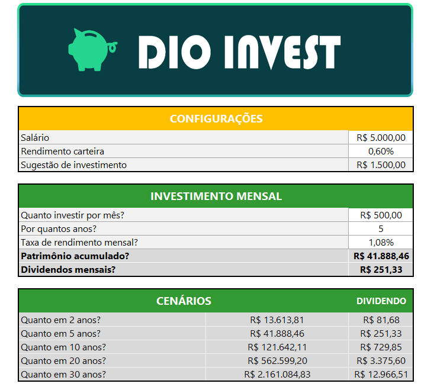

# 📊 Simulador de Investimentos em Fundos Imobiliários — Excel

## Objetivo

  Este projeto foi desenvolvido como parte do desafio da DIO com o objetivo de aplicar conceitos de Excel na criação de uma ferramenta prática de simulação de investimentos    em fundos imobiliários.

  A planilha permite simular cenários de investimento considerando valor aplicado, tempo, taxa de rendimento e cálculo de dividendos.

## Recursos utilizados

  - Excel
  - Fórmulas financeiras
  - Cálculo de rendimento mensal
  - Projeção de patrimônio
  - Simulação de dividendos

## Funcionalidades

  - Simulação de valor investido ao longo do tempo
  - Cálculo de rendimento mensal
  - Projeção de patrimônio acumulado
  - Estimativa de dividendos
  - Ajuste de parâmetros de investimento

## Como usar

  - Abra a planilha no Excel
  - Preencha os campos de valor investido, taxa e prazo
  - Visualize automaticamente os resultados projetados

## Autor

Laís Simonelli
Projeto desenvolvido como parte do desafio prático da DIO, seguindo as orientações das videoaulas da plataforma.

## Aprendizados

Neste projeto apliquei e pratiquei:

  - Criação de planilhas de simulação financeira no Excel  
  - Uso de fórmulas para cálculo de rendimento mensal e patrimônio acumulado  
  - Estruturação de modelo para estimativa de dividendos  
  - Organização e documentação de projeto no GitHub  
  - Uso de README para descrever tecnicamente uma solução

    
## Imagens do Projeto

